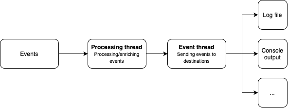

.. EventManagerPy documentation master file, created by
   sphinx-quickstart on Tue Apr 22 22:21:59 2025.
   You can adapt this file completely to your liking, but it should at least
   contain the root `toctree` directive.

Welcome to EventManager's Documentation!
========================================

EventManager is a powerful and flexible, asynchronous logging library for event logging in Python. It follows the goal
to provide developers the possibility to create custom event logging systems that can be tailored to their specific
needs. The configuration options range from setting up event formats, defining how events are processed, to specifying
how and where the events are outputted.

The events are logged in a asynchronous manner, which means that the logging process does not block the main thread of
the application. To offer extensive features when it comes to processing and outputting events the library relies on a
pipeline.

Events are generated, passed to the processing thread, which processes and/or enriches events and are then passed to the
output thread, which handles the output of the events.

Getting Started
---------------

To begin using EventManager, check out the :doc:`tutorial/tutorial`.

Tutorial
------------

This section provides a step-by-step guide to get you started with EventManager.
It covers installation, basic usage, and advanced configurations.

.. toctree::
   :maxdepth: 2
   :caption: Tutorial

   tutorial/installation
   tutorial/tutorial
   tutorial/config_file
   tutorial/event_creator
   tutorial/event_format
   tutorial/processors
   tutorial/outputs

API Documentation
-----------------

Below you can find API references for the entire library, categorized by component.

.. toctree::
   :maxdepth: 2
   :caption: API Reference

   api/compressors
   api/filehandlers
   api/formatters
   api/internal
   api/outputs
   api/processors
